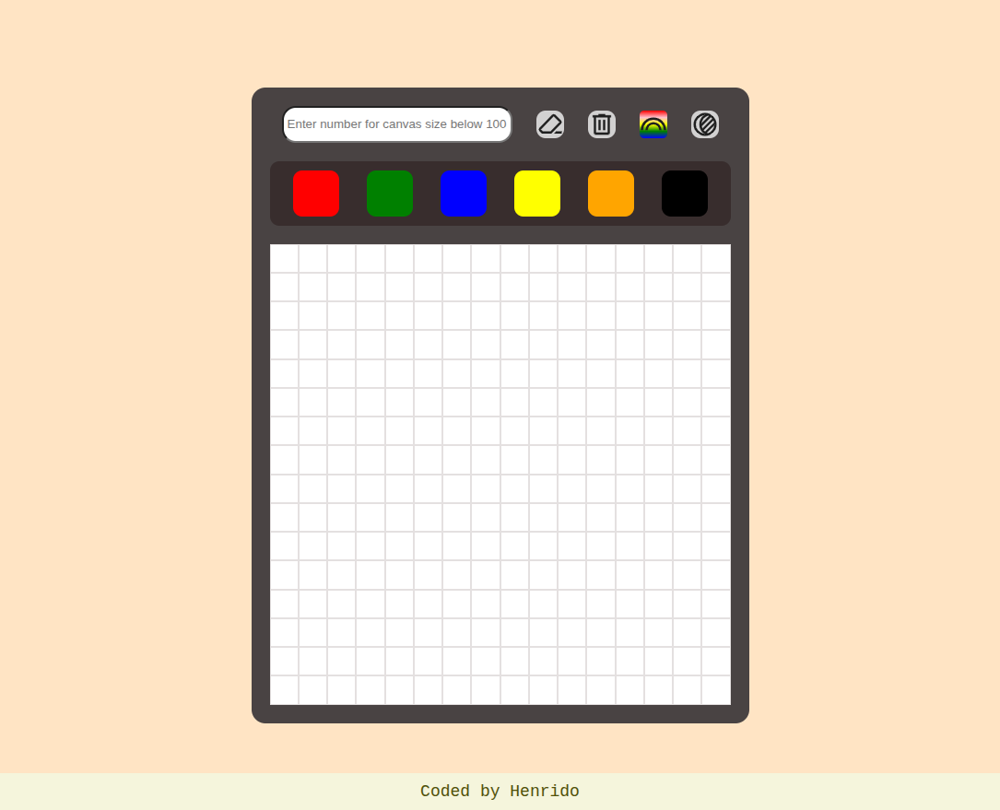

Overview:

My solution to the DOM manipulation targeted etch-a-sketch project by TOP.

Screenshot:

What i learned?

I got to show off my DOM manipulation skills and learned a ton about manipulating the dom with javascript.

Screenshot

Thought process?

Step 1 : I read the instructions in TOP regarding this project carefully to see what was expected of this project.

Step 2 : I started by creating a HTML skeleton and then  a container for all the future divs that are gonna fill the grid-container.

Step 3 : I created a basic visual box to fit the divs into to visualize the process.

Step 4 : I hopped on to javascript and started by creating a function that returns the correct amount of divs.

Step 5 : Then i started to create a function that would display the divs based on the number of divs in the array.

Step 6 : And here the most difficult part was to get the container holding the divs to fit the right size, i went with a more flexible approach and i thought i could get it working so i could have a perfectly symmetrical grid. But i ended up with hardcoding pixel values to containers width and height, since i could just fit the items based on the values.

Step 7 : I started with the ui and color pick options.

Step 8 : I created eraser and erase all options.

Step 9 : I also created a rainbow feature where each div gets colored randomly with each interaction. 

Step 10 : Create shadow feature where each divs opacity lowers toward black container background for shadow effect.

Step 11 : Thats it!

